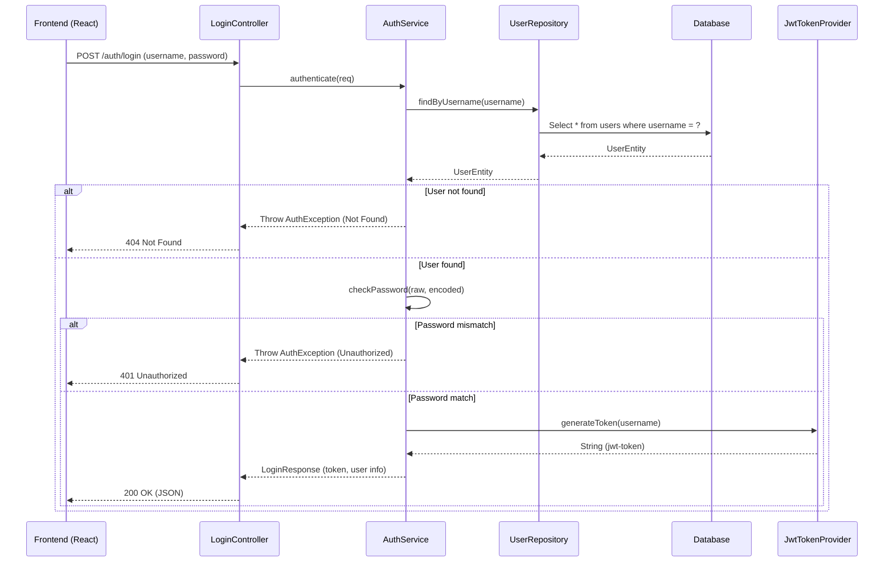
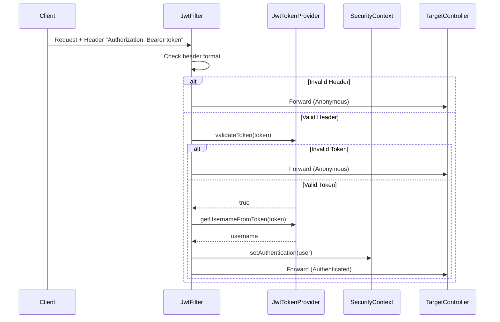

# Phân tích dự án FLOGINFE_BE

## Phần 1: Cấu trúc thư mục và Tổng quan

### Backend (`FLOGINFE_BE/backend`)

Thư mục gốc chứa cấu hình Maven và môi trường.

*   **`pom.xml`**: Quản lý dependencies của Maven. Các dependencies chính:
    *   `spring-boot-starter-data-jpa`: Tương tác database.
    *   `spring-boot-starter-security`: Bảo mật, xác thực.
    *   `mysql-connector-j`: Driver MySQL.
    *   `spring-boot-starter-web`: REST API.
    *   `jjwt-api`, `jjwt-impl`, `jjwt-jackson`: Thư viện JWT.
    *   `spring-dotenv`: Đọc biến môi trường từ `.env`.
*   **`.env`**: Biến môi trường (Database credentials, JWT secret, Ports).
*   **`.gitignore`**: Các file/folder bị bỏ qua bởi Git (target, .env, IDE settings).
*   **`src/main/resources/application.properties`**: Cấu hình Spring Boot, ánh xạ các biến từ `.env`.

#### Source Code (`src/main/java/com/flogin`)

*   **`BackendApplication.java`**: Class chính để chạy ứng dụng Spring Boot.
*   **`configuration/`**:
    *   `JwtFilter.java`: Filter kiểm tra JWT trong header request.
    *   `JwtTokenProvider.java`: Tạo và validate JWT.
    *   `RequireAuth.java`: Annotation tùy chỉnh để yêu cầu xác thực.
    *   `SecurityConfig.java`: Cấu hình Spring Security (Filter chain, CORS, PasswordEncoder).
*   **`controller/`**:
    *   `ConfigController.java`: API trả về cấu hình frontend/backend url.
    *   `LoginController.java`: API đăng nhập.
    *   `UserController.java`: API CRUD User.
*   **`dto/`**:
    *   `login/LoginRequest.java`: Model nhận dữ liệu đăng nhập.
    *   `login/LoginResponse.java`: Model trả về kết quả đăng nhập (kèm token).
    *   `user/UserRequest.java`: Model tạo/sửa user.
    *   `user/UserResponse.java`: Model trả về thông tin user.
*   **`entity/`**:
    *   `UserEntity.java`: Entity ánh xạ bảng `users` trong DB.
*   **`exception/`**:
    *   `AuthException.java`: Lỗi xác thực.
    *   `ErrorResponse.java`: Format lỗi trả về API.
    *   `ExistsException.java`: Lỗi dữ liệu đã tồn tại.
    *   `GlobalExceptionHandler.java`: Xử lý lỗi tập trung (@ControllerAdvice).
    *   `NotFoundException.java`: Lỗi không tìm thấy dữ liệu.
*   **`mapper/`**:
    *   `UserMapper.java`: Chuyển đổi giữa Entity và DTO.
*   **`repository/`**:
    *   `UserRepository.java`: Interface JpaRepository tương tác DB.
*   **`service/`**:
    *   `AuthService.java`: Logic nghiệp vụ đăng nhập.
    *   `UserService.java`: Logic nghiệp vụ quản lý User.

### Frontend (`FLOGINFE_BE/frontend`)

*   **`package.json`**: Quản lý dependencies (React, Vite, Tailwind, Radix UI, React Hook Form, Zod, Axios).
*   **`.env`**: Biến môi trường Frontend (`VITE_PORT`, `VITE_PUBLIC_API`).
*   **`src/`**:
    *   **`App.tsx`**: Định nghĩa Routing (Login, Dashboard).
    *   **`main.tsx`**: Entry point, render App vào DOM.
    *   **`index.css`**: Global styles, Tailwind imports.
    *   **`vite-env.d.ts`**: Type definitions cho Vite.
    *   **`components/`**:
        *   `LoginIllustration.tsx`: Ảnh minh họa trang login.
        *   `ui/`: Các component UI tái sử dụng (Button, Input, Card, etc. - shadcn/ui).
    *   **`hooks/`**:
        *   `use-mobile.ts`: Hook kiểm tra thiết bị mobile.
    *   **`lib/`**:
        *   `utils.ts`: Hàm tiện ích (cn - classnames merge).
    *   **`page/admin/`**:
        *   `LoginPage.tsx`: Trang đăng nhập.
        *   `Dashboard.tsx`: Trang Dashboard chính.
        *   `AccountPage.tsx`: Trang quản lý tài khoản (đang phát triển).
        *   `ProductPage.tsx`: Trang sản phẩm (trống).
    *   **`types/`**:
        *   `user.ts`: Interface TypeScript cho User và Login Response.

---

## Phần 2: Phân tích chi tiết Backend

### 1. Configuration (`com.flogin.configuration`)

Gói này chịu trách nhiệm cấu hình bảo mật và xử lý JWT.

*   **`SecurityConfig.java`**:
    *   Thiết lập `SecurityFilterChain`.
    *   Vô hiệu hóa CSRF, set session thành STATELESS (vì dùng JWT).
    *   Cấu hình CORS cho phép `localhost`.
    *   Thêm `JwtFilter` trước `UsernamePasswordAuthenticationFilter`.
    *   Định nghĩa các endpoint `permitAll` (public) và `authenticated` (cần đăng nhập).

    ```java
    // SecurityConfig.java snippet
    @Bean
    public SecurityFilterChain securityFilterChain(HttpSecurity http) throws Exception {
        http.csrf(AbstractHttpConfigurer::disable)
                .sessionManagement(sm -> sm.sessionCreationPolicy(SessionCreationPolicy.STATELESS))
                .addFilterBefore(jwtFilter, UsernamePasswordAuthenticationFilter.class)
                .authorizeHttpRequests(auth -> auth
                        .requestMatchers("/auth/**").permitAll() // Cho phép API auth
                        .anyRequest().authenticated()); // Các API khác cần login
        return http.build();
    }
    ```

*   **`JwtTokenProvider.java`**:
    *   Dùng thư viện `jjwt` để tạo token từ username và secret key.
    *   Validate token và lấy username từ token.

*   **`JwtFilter.java`**:
    *   Kế thừa `OncePerRequestFilter`.
    *   Lấy header `Authorization`, cắt chuỗi `Bearer `.
    *   Nếu token hợp lệ, tạo `UsernamePasswordAuthenticationToken` và set vào `SecurityContextHolder`.

### 2. Entity & Repository

*   **`UserEntity.java`**: Sử dụng Lombok (`@Data`, `@Builder`) và JPA (`@Entity`).
    *   Các trường: `id`, `username` (unique), `password`, `mail`.
*   **`UserRepository.java`**: Kế thừa `JpaRepository`.
    *   Thêm các method: `existsByMail`, `existsByUsername`, `findByUsername`.

### 3. Service (`com.flogin.service`)

Chứa logic nghiệp vụ cốt lõi.

*   **`AuthService.java`**:
    *   `authenticate`: Tìm user theo username -> check password (dùng `PasswordEncoder`) -> nếu đúng tạo JWT -> trả về `LoginResponse`.

    ```java
    // AuthService.java snippet
    public LoginResponse authenticate(LoginRequest loginRequest) {
        UserEntity user = repo.findByUsername(loginRequest.getUsername())
                .orElseThrow(() -> new AuthException("Tài khoản hoặc mật khẩu không đúng", HttpStatus.NOT_FOUND));
        if (!passwordEncoder.matches(loginRequest.getPassword(), user.getPassword()))
            throw new AuthException("Mật khẩu không chính xác", HttpStatus.UNAUTHORIZED);
        return new LoginResponse(true, "Đăng nhập thành công", jwtTokenProvider.generateToken(user.getUsername()), UserMapper.toResponse(user));
    }
    ```

*   **`UserService.java`**:
    *   `create`: Check trùng username/email -> mã hóa password -> lưu DB.
    *   `getAll`, `getById`, `delete`: Các thao tác CRUD cơ bản.

### 4. Controller (`com.flogin.controller`)

*   **`LoginController.java`**:
    *   Endpoint `POST /auth/login`.
    *   Nhận `LoginRequest`, gọi `AuthService`, trả về `LoginResponse`.
*   **`UserController.java`**:
    *   Các endpoint `/users` (GET, POST, DELETE).
    *   Sử dụng `@RequireAuth` (mặc dù đã config trong SecurityConfig, annotation này có thể dùng để check kỹ hơn hoặc đánh dấu).
*   **`ConfigController.java`**:
    *   Trả về cấu hình runtime cho frontend nếu cần.

### 5. Exception Handling

*   **`GlobalExceptionHandler.java`**:
    *   Bắt các exception như `AuthException`, `NotFoundException`, `ExistsException`.
    *   Trả về JSON `ErrorResponse` chuẩn (status, message, timestamp).

---

## Phần 3: Phân tích chi tiết Frontend

### 1. Cấu trúc & Routing

*   **`App.tsx`**: Sử dụng `react-router-dom`.
    *   `/login` -> `LoginPage`
    *   `/dashboard` -> `DashboardPage`

### 2. UI Components (shadcn/ui)

Dự án sử dụng thư viện component shadcn/ui (dựa trên Radix UI và Tailwind).
*   Các file trong `components/ui/` như `button.tsx`, `input.tsx`, `card.tsx` là các component nguyên tử được style bằng Tailwind.
*   Ví dụ `Button` có các variant `flogin_activate` được custom riêng.

### 3. Pages

*   **`LoginPage.tsx`**:
    *   Giao diện chia 2 phần (nếu màn hình lớn) hoặc tập trung vào form.
    *   Sử dụng `Card` để đóng gói form.
    *   Form gồm Input Username và Password.
    *   Button submit gọi API (hiện tại code chưa thấy gọi API `axios` trong component này, chỉ là UI thuần).

    ```tsx
    // LoginPage.tsx snippet
    <Card className="w-120 gap-y-8 rounded-4xl">
        <CardHeader>...</CardHeader>
        <CardContent>
            <form className="flex flex-col gap-y-2">
                <Label>Tên đăng nhập</Label>
                <Input id="username" ... />
                <Label>Mật khẩu</Label>
                <Input id="password" type="password" ... />
            </form>
        </CardContent>
        <CardFooter>
            <Button type="submit" variant="flogin_activate">Đăng nhập</Button>
        </CardFooter>
    </Card>
    ```

*   **`Dashboard.tsx`**:
    *   Layout cơ bản với Sidebar bên trái (w-80) và Content bên phải.

### 4. Styling

*   **`index.css`**:
    *   Định nghĩa các biến CSS (CSS Variables) cho màu sắc (`--primary`, `--background`, etc.) hỗ trợ Dark/Light mode.
    *   Config Tailwind `@theme` để sử dụng các biến này.

---

## Phần 4: Luồng Backend (Flow Diagram)

Dưới đây là sơ đồ luồng xử lý khi người dùng thực hiện Đăng nhập.



### Luồng xác thực Request (JWT Filter)


